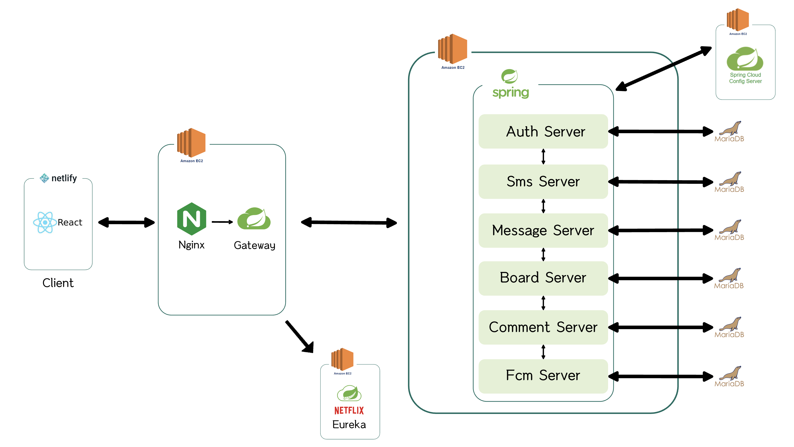

### 개요

DO표는 일상 속 말하기 애매했던 고민이나 생각들을 부담 없이 투표를 통해 소통할 수 있는 커뮤니티입니다.  
유튜버들이 커뮤니티 탭의 투표 기능을 활용해 구독자들과 가볍게 소통하는 모습에서 아이디어를 얻어 만들게 됐습니다.
사용자들은 자유롭게 투표 게시글을 작성하고, 투표에 참여한 뒤 댓글을 통해 서로의 생각을 나눌 수 있습니다.

- 문서: [](구해줘!룸메.pdf)
- 코드: [](https://github.com/l0o0lv/DoVote-MSA) 
- 사용 기술: SpringBoot, SCG(Eureka, Config, OpenFeign), MariaDB, Redis, AWS EC2, Jenkins, Nginx
- 개발 기간: 2023년 9월 - 2024년 6월

### 중간 데모영상


### 최종 데모영상


### 프로젝트 구조

### 내 역할
1. 웹소켓 기반 실시간 쪽지 기능 구현
    - 쪽지가 왔을 때 즉각적인 알람 기능을 구현해 유저 간의 소통을 보다 편리하게 했습니다.

2. Blue-Green 전략을 활용한 CI/CD 파이프라인 구축
    - Jenkins, Nginx, Github Webhook, EC2 기반 파이프라인 구축
    - 기존 3분 이상 소요되던 수동 배포 방법에서 1분 이내의 자동화된 배포로 전환
    - Health Check 및 Nginx 리버스 프록시 자동 스위칭으로 서비스 안정적으로 유지

3. Monolithic -> MSA 구조로 프로젝트 리팩토링
    - Spring Cloud (Eureka, Config Server, Gateway) 기반의 마이크로서비스 아키텍처 도입
    - 하나의 서비스 오류로 전체가 멈추던 문제 해결, 장애 복구 시간 50% 이상 단축
    - OpenFeign을 통한 서비스 간 통신을 적용해 API 간 응답시간 평균 200ms 이내로 최적화
    
4. Redis, CoolSms 기반 휴대폰 인증 기능 구현
    - 인증번호 발송 기능을 CoolSms API로 구현하고, Redis를 이용해 인증번호 임시 저장 및 만료처리

### CI/CD 데모 영상


### MSA 데모 영상


<!-- ### 개발 동기

### <u>내가 기여한 점</u>

1. MVVM 디자인 패턴 적용
    - Data Binding을 통해 UI와 사용자 입력을 분리함으로써 DB 데이터 변경과 디자인 요소를 각각 관리하도록 했습니다.
2. 기능 구현
    
    - 이메일 인증: 랜덤 생성해 발송한 코드와 사용자 입력이 일치하는지 확인함으로써 회원가입 시 교내 학생임을 보장했습니다.
    
    - 프로필: 임시 객체에 DB 정보를 파싱한 후, 사용자가 값을 수정했을 때 DB 정보를 갱신하도록 했습니다.
    
    - 검색: 사용자 입력으로 DB에서 탐색한 데이터를 ListView로 표시하도록 했습니다.
    
    - 채팅: 전송 버튼을 클릭했거나 서버에서 상대가 전송한 메시지를 확인했을 때 채팅 메시지 ListView를 갱신하도록 했습니다.

### 한계

1. 비동기 통신의 부재
    - 소켓 기반의 실시간 채팅만 구현했다는 점이 아쉬움으로 남습니다.
2. UI
    - 사용자 친화적인 인터페이스를 제공하지 못했습니다.